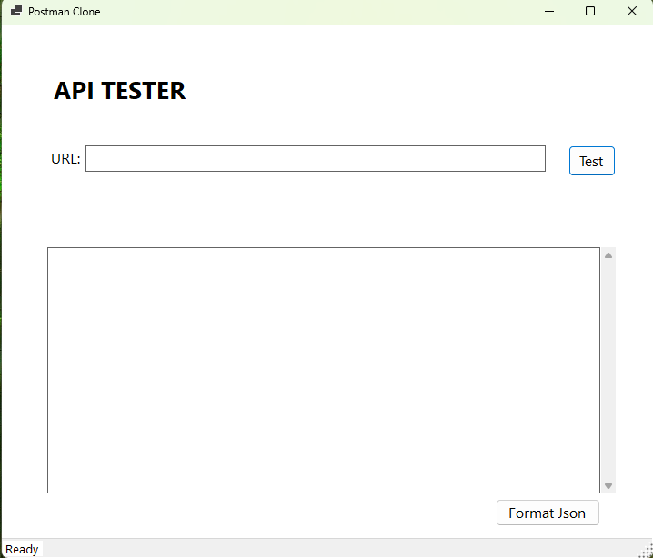
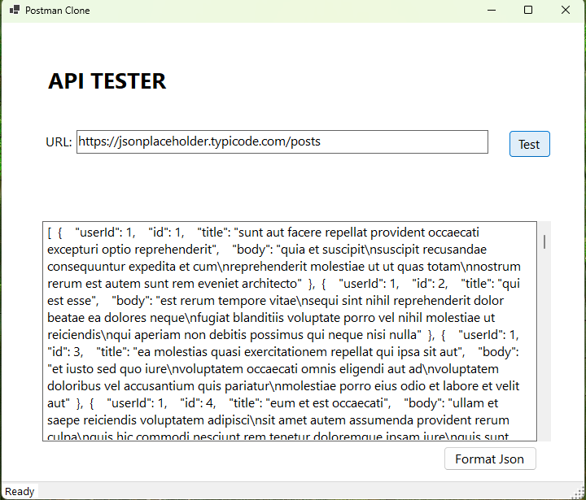
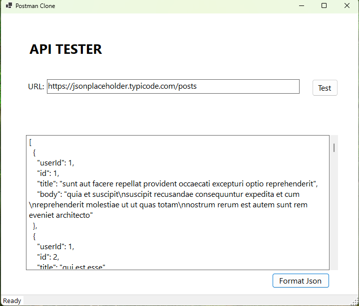

# API TESTER(Postman clone app)
Api tester provides a user-friendly interface for making GET requests to APIs and viewing the responses in raw and formatted JSON. Best for Developers and testers, this tool is easy to use and straight forward.

## Technologies Used
* C#
* .NET 10
* WinForms
* HttpClient
* Json
* O.O.P
* Mock Apis - https://jsonplaceholder.typicode.com/

## Using The App
1. Run the project solution.
2. The UI should look like the below picture when the app is launched

3. Type or Fill in your URL(End point) inside the textbox and press Test Button

4. You can format your response by clicking the "Format Json" button

5. If you are impressed, you can hire me.

## Upcoming Changes
* Adding POST, PUT, PATCH, and DELETE HTTP Methods
* Adding API Headers
* Adding Dependency Injection
* Create a Web-based user interface for the application
